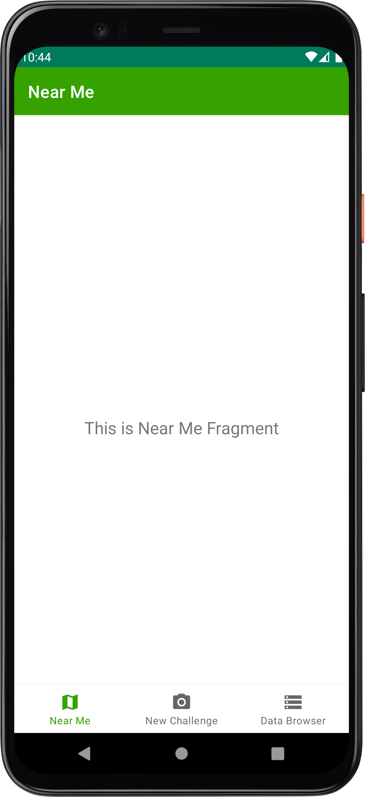
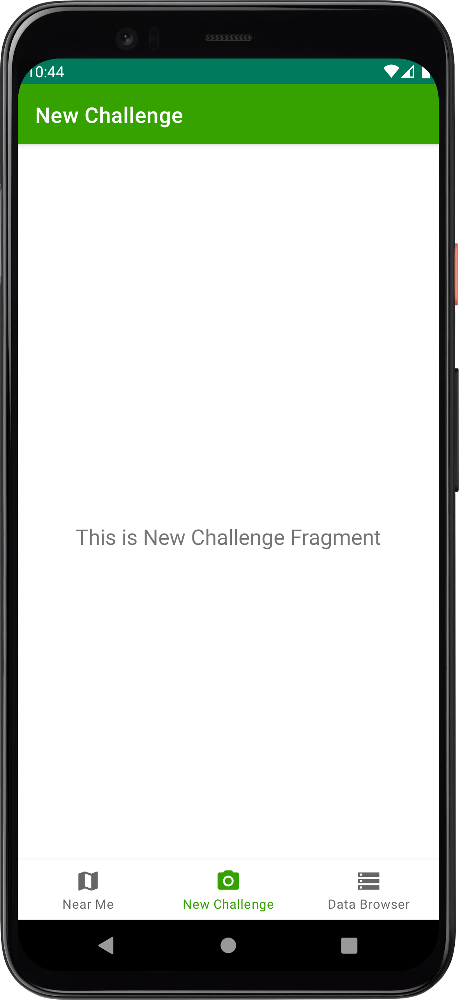
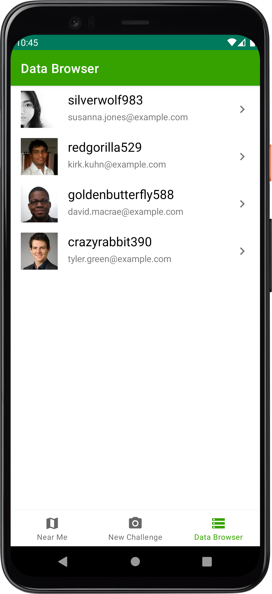

# iSpyChallenge

This repository contains an Android Studio project that is used as a starting point for the iSpy App Tech challenge.

## Challenge

The goal of the challenge is to provide a project for you to be able to demonstrate your core strengths and evaluate your technical skills. The prompt of your challenge will be provided by the hiring manager or interviewer for your role and you will be building on top of the pre-defined application. You may use your own computer for the challenge and feel free to treat this as your normal environment, so utilizing the internet and libraries to achieve your solution is permitted. The only ask if you are copying and pasting any code from online or old code base, please provide comments to show you understand what you're copying.

The concept for the app is a global game of "I Spy" where users can take pictures of objects they find in the world and have others try to find the same object given only a cryptic hint.

The application contains 3 tabs:

* Near Me: Placeholder for your work
* New Challenge: Placeholder for your work
* Data Browser: Tab to allow you to explore the data included in the project.

If any questions/concerns come up during the challenge, please feel free to reach out to your interview to get answers/clarifications.

## Setup Process

In order to start the challenge, we ask candidates to clone the repository in their own GitHub account. Please refer to the below snippet of code to create a clone of the project. All you need to do is update the `[username]` tag with your own GitHub username.

````
$ cd ~/Desktop
$ git clone https://github.com/BlueOwlDev/iSpyChallenge-Android.git --origin BlueOwl mySpyChallenge
$ cd mySpyChallenge
$ git remote add origin https://github.com/[username]/mySpyChallenge.git
$ git push -u origin main
````

## Submit Process

Once you have completed your challenge, we ask that you commit your changes to your main branch and push them up to remote origin. Then please provide the hiring manager or your interviewer a link to your project so we can then download the ZIP for reviewing/archiving. We appreciate and thank you for taking the time to take our challenge.

## Project Overview

The model objects for the app are provided, along with some sample data for use during the exercise. All data is maintained in memory and is loaded from the sample JSON files, via a mock API service, when the app launches.

Access to the sample data is provided via the DataRepository class. You will need to utilize this class in order to complete the challenge. ISpyApplication constructs the DataRepository and is retrieved by fragments/activities and injected into view models (One example being the DataBrowserViewModel). 

## Screenshots

The following screenshots are what the initial implementation of the application looks like.

<kbd>

<kbd>

<kbd>
